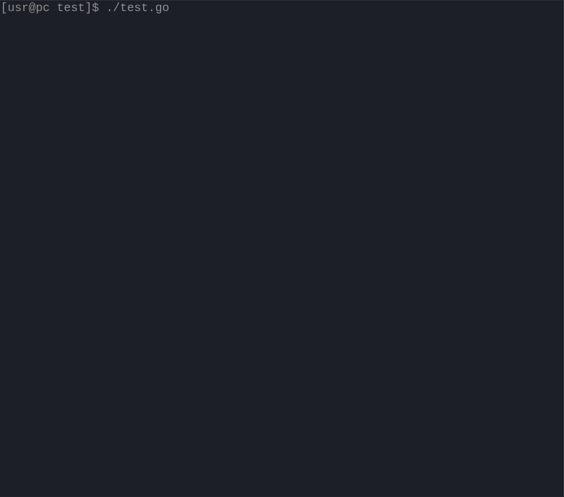

# goash
PoC for writing "shell scripts" in Go.

Example:



```go
//$(which go) run $0 $@; exit $?
package main

import (
    . "github.com/alnionet/goash"
)

func main() {
    Sh("sleep 1 && echo Simple command")

    Sh("echo This command writes directly to the terminal > /dev/tty")

    Sh("ls /root")

    Sh("sudo ls /root -la")

    Shd("Command with lots of output.", "echo Lorem ipsum dolor sit amet, consectetur adipiscing elit, sed do eiusmod tempor incididunt ut labore et dolore magna aliqua. Ut enim ad minim veniam, quis nostrud exercitation ullamco laboris nisi ut aliquip ex ea commodo consequat.")

    Sh("echo Wrap just the long command, has no output. Lorem ipsum dolor sit amet, consectetur adipiscing elit, sed do eiusmod tempor incididunt ut labore et dolore magna aliqua. Ut enim ad minim veniam, quis nostrud exercitation ullamco laboris nisi ut aliquip ex ea commodo consequat. > /dev/null")
}

```
